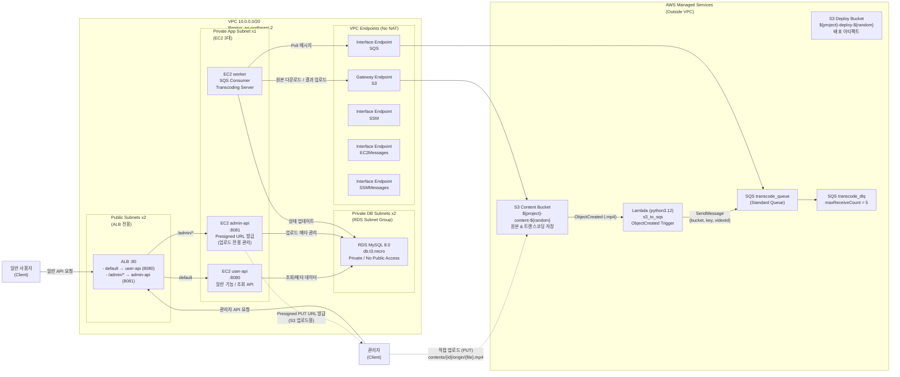

## 📌 1. Project Overview
**O+T(오쁠티)** 는 단순 알고리즘 추천의 한계를 보완하고 사용자의 콘텐츠 탐색 피로도를 낮추기 위해 기획된 숏폼/롱폼 연계 OTT 플랫폼입니다.
본 레포지토리는 서비스의 백엔드 API 서버 및 비동기 영상 트랜스코딩 시스템을 포함하고 있습니다.

핵심 비즈니스 로직은 **에디터/관리자 기반의 숏폼 업로드**와 **숏폼에서 본편(롱폼)으로의 즉각적인 전환(CTA)** 을 지원하는데 맞춰져 있습니다.
기술적으로는 대용량 영상 처리로 인한 API 서버 부하를 방지하고 HLS 기반의 적응형 스트리밍(ABR) 을 안정적으로 제공하는 인프라 및 소프트웨어 아키텍처 설계에 집중했습니다.

<br>

## 🛠️ 2. 기술 스택 (Tech Stack)
1. **언어 및 프레임워크:** Java, Spring Boot, Spring Data JPA, QueryDSL

2. **데이터베이스:** MySQL 8.0, Flyway

3. **로깅 및 모니터링:** Prometheus, Grafana, Loki

4. **인프라:** AWS (EC2, RDS, S3, Lambda, ALB, VPC Endpoint)

5. **메시지 큐:** AWS SQS (or RabbitMQ)

6. **CI/CD 및 기타:** GitHub Actions, Docker, FFmpeg (Media Processing)

<br> 

## 3. 시스템 및 인프라 아키텍처
### 3.1 🏗️ 전체 인프라 아키텍처 (System Architecture)



위 다이어그램은 O+T 서비스의 핵심 인프라 구성도로, 네트워크 보안 강화, 비용 최적화, 미디어 처리의 비동기화에 초점을 맞추어 설계되었습니다.

#### 1. 네트워크 격리 및 보안(VPC & Subnate)
- 외부의 모든 클라이언트 트래픽은 Public Subnet에 위치한 ALB(Application Load Balancer) 1곳을 통해서만 인입됩니다.

- 실제 비즈니스 로직이 실행되는 3대의 EC2(User API, Admin API, Transcoder Worker)와 데이터가 저장되는 RDS MySQL은 모두 Private Subnet에 완벽히 격리하여 외부 인터넷으로부터의 직접적인 접근을 원천 차단했습니다.

#### 2. 도메인별 트래픽 라우팅 분리
- ALB의 경로 기반 라우팅(Path-based Routing) 규칙을 적용하여 물리적인 서버 인스턴스를 분리했습니다.

- 에디터 전용 업로드 및 관리자 요청(/admin/*)은 Admin API 인스턴스(8081 포트)로, 검색/피드 조회/스트리밍 등 트래픽이 집중되는 일반 대고객 요청은 User API 인스턴스(8080 포트)로 전달하여 도메인 간 간섭을 최소화했습니다.

#### 3. No-NAT 기반 프라이빗 통신(VPC Endpoints)
- Private Subnet 내부의 서버가 외부 AWS Managed Service(S3, SQS 등)와 통신하기 위해 필수적인 NAT Gateway를 과감히 제거했습니다. (월 고정 비용 절감)

- 대신 AWS 내부망 전용선인 VPC Endpoints를 구축했습니다. 대용량 영상의 다운로드/업로드는 무료인 S3 Gateway Endpoint를 거치며, 작업 대기열 확인은 SQS Interface Endpoint를 통해 퍼블릭 인터넷망 노출 없이 안전하고 빠르게 처리됩니다.

#### 4. 서버리스 이벤트 브릿지(Event-Driven Pipeline)
- Admin API가 S3 Presigned URL을 발급하면, 클라이언트는 서버를 거치지 않고 S3 버킷으로 원본 영상을 직행시킵니다.

- 영상이 S3에 도착하면 발생하는 ObjectCreated 이벤트를 AWS Lambda가 즉시 낚아채어, 메타데이터와 함께 **SQS(Standard Queue)**로 트랜스코딩 작업 메시지를 밀어 넣습니다.


#### 5. 보안 접속 및 CI/CD 배포 자동화(AWS SSM)
- 보안 위협이 될 수 있는 외부 SSH 포트(22) 개방이나 별도의 Bastion Host(점프 서버) 구축을 배제했습니다.

- SSM Interface Endpoint를 통해 AWS Systems Manager(Session Manager, Run Command)로 Private EC2에 안전하게 접속하며, GitHub Actions와 연동하여 무중단 자동 배포 파이프라인을 구동합니다.


### 3.2 📁 소프트웨어 아키텍처 (Multi-Module Monorepo)
영상 트랜스코딩(FFmpeg)은 CPU 자원을 극도로 소모하는 작업입니다. 단일 모놀리식 구조에서 API 요청 처리와 인코딩 작업을 병행할 경우, 인코딩 부하가 일반 사용자 API의 응답 지연 및 장애로 전파될 위험이 있습니다.
이를 방지하고 개발 효율성을 높이기 위해 멀티 모듈 모노레포 및 레이어드 아키텍처를 채택했습니다.

- **배포 단위 분리 (apps/):**
  - api-user: 일반 사용자의 콘텐츠 검색, 재생, 통계 조회를 전담하는 API 서버.

  - api-admin: 관리자 및 에디터의 메타데이터 관리, 영상 업로드(Presigned URL 발급)를 전담하는 백오피스 서버.

  - transcoder: 외부 요청을 직접 받지 않고, SQS 메시지를 폴링하여 비동기로 영상을 변환하는 워커(Worker) 서버.
 
- **공통 모듈 분리 (modules/):**
  - 각 서버에서 공통으로 사용하는 도메인(Entity, Repository), 인프라 연동(S3, SQS 설정), 웹 공통(예외 처리, 응답 DTO), 보안(JWT, OAuth) 로직을 분리하여 코드 중복을 제거했습니다.

```
repo-root/
├── apps/                    ← 실제 배포 단위 (각각 독립 JAR)
│   ├── api-admin/           ← 관리자/에디터 API 서버
│   ├── api-user/            ← 사용자 API 서버  
│   └── transcoder/          ← 트랜스코딩 워커
│
├── modules/                 ← 공유 모듈 (단독 실행 불가, 앱에서 의존)
│   ├── domain/              ← 전체 Entity + Repository (JPA)
│   ├── infra/               ← JPA 설정 + S3 설정
│   ├── common-web/          ← 예외처리, 응답 포맷
│   └── common-security/     ← JWT, OAuth
│
├── settings.gradle
└── docker-compose.yml


----------------------------------------


repo-root/
├── apps/
│   ├── api-admin/                      # 백오피스 서버 (JAR)
│   │   └── src/main/java/com/ott/admin/
│   │       ├── content/
│   │       │   ├── controller/
│   │       │   ├── service/
│   │       │   └── dto/
│   ├── api-user/                       # 사용자 API 서버 (JAR)
│   │   └── src/main/java/com/ott/user/
│   │       ├── auth/
│   │       │   ├── controller/
│   │       │   ├── service/
│   │       │   └── dto/
│   │       ├── content/
│   │       │   ├── controller/
│   │       │   ├── service/
│   │       │   └── dto/
│   │       └── config/
│   │
│   └── transcoder/                     # 트랜스코딩 워커 (JAR)
│       └── src/main/java/com/ott/transcode/
│           ├── worker/
│           ├── service/
│           └── config/
│
├── modules/
│   ├── domain/                         # 전체 도메인 (Entity + Repository)
│   │   └── src/main/java/com/ott/domain/
│   │       ├── content/
│   │       │   ├── entity/
│   │       │   └── repository/
│   │       └── series/
│   │           ├── entity/
│   │           └── repository/
│   │
│   ├── infra/                          # DB + S3 설정
│   │   └── src/main/java/com/ott/infra/
│   │       ├── db/
│   │       │   ├── config/
│   │       │   └── BaseEntity.java
│   │       └── s3/
│   │           ├── config/
│   │           └── S3FileService.java
│   │
│   ├── common-web/                     # 웹 공통
│   │   └── src/main/java/com/ott/common/web/
│   │       ├── exception/
│   │       └── response/
│   │
│   └── common-security/                # 인증/인가 공통
│       └── src/main/java/com/ott/common/security/
│           ├── jwt/
│           └── oauth/
│
├── docker-compose.yml
├── settings.gradle
└── build.gradle
```

<br>

## 4. 핵심 기술 및 비즈니스 로직
### 4.1 업로드 및 트랜스코딩 프로세스 (Event-Driven Ingest)
대용량 영상 파일 업로드 시 API 서버의 I/O 병목을 방지하기 위해 다이렉트 업로드 및 비동기 큐잉 방식을 적용했습니다.


1. 업로드 URL 발급 요청: 에디터/관리자가 API 서버(api-admin)에 업로드용 Pre-signed URL을 요청합니다.

2. Pre-signed URL 발급: API 서버가 S3용 Pre-signed URL을 생성 후 클라이언트에 반환합니다.

3. 원본 영상 업로드: 클라이언트가 발급받은 Pre-signed URL을 사용하여 S3에 원본 영상을 직접 업로드합니다.

4. 업로드 완료 이벤트 발행: S3 ObjectCreated 이벤트가 발생하면 EventBridge/Lambda를 거쳐 SQS 큐에 업로드 완료 이벤트(작업 메시지)가 적재됩니다.

5. 트랜스코더 이벤트 소비: 격리된 트랜스코딩 서버(Worker)가 SQS 큐 메시지를 수신(폴링)합니다.

6. 트랜스코딩 작업 수행: FFmpeg를 구동하여 원본 영상을 기반으로 해상도 및 비트레이트별(360p, 720p, 1080p) 인코딩을 동시 수행합니다.

7. HLS 패키징: 스트리밍이 가능한 HLS 형식으로 패키징하여 .m3u8(Playlist) 및 .ts(Segment) 파일들을 생성합니다.

8. 결과물 업로드: 패키징이 완료된 최종 HLS 결과물을 S3에 업로드하고 데이터베이스 상태를 업데이트합니다.


### 4.1 스트리밍(영상 재생) 파이프라인 (HLS & ABR)
사용자의 디바이스 및 실시간 네트워크 환경에 맞춰 최적의 화질을 끊김 없이 제공하는 ABR(Adaptive Bitrate) 재생 프로세스입니다.

```mermaid
sequenceDiagram
    autonumber
    title HLS 스트리밍 재생 흐름

    actor User as 사용자
    participant Player as 비디오 플레이어<br/>(hls.js)
    participant ABR as ABR 엔진
    participant Buffer as 버퍼 관리자
    participant CDN as CDN<br/>(CloudFront)
    participant S3 as Origin<br/>(S3)

    %% 1. 초기화 및 Master Playlist 요청
    rect rgb(232, 245, 233)
        Note over User, S3: 1. 초기화 및 Master Playlist 요청
        User->>Player: 영상 재생 클릭
        activate Player
        Player->>CDN: GET /video/{id}/master.m3u8
        activate CDN
        
        alt 캐시 히트
            CDN-->>Player: master.m3u8 반환
        else 캐시 미스
            CDN->>S3: master.m3u8 요청
            activate S3
            S3-->>CDN: master.m3u8
            deactivate S3
            CDN->>CDN: 캐시 저장
            CDN-->>Player: master.m3u8 반환
        end
        deactivate CDN
        
        Player->>Player: 화질 목록 파싱<br/>(360p, 720p, 1080p)
    end

    %% 2. 초기 화질 선택
    rect rgb(227, 242, 253)
        Note over User, S3: 2. 초기 화질 선택
        Player->>ABR: 초기 화질 결정 요청
        activate ABR
        ABR->>ABR: 네트워크 대역폭 측정<br/>(3 Mbps)
        ABR->>ABR: 안전 마진 적용<br/>(3 × 0.8 = 2.4 Mbps)
        ABR-->>Player: 720p 선택<br/>(BANDWIDTH=2500000)
        deactivate ABR
    end

    %% 3. Media Playlist 요청
    rect rgb(255, 243, 224)
        Note over User, S3: 3. Media Playlist 요청
        Player->>CDN: GET /video/{id}/720p/playlist.m3u8
        activate CDN
        CDN-->>Player: 720p playlist.m3u8
        deactivate CDN
        Player->>Player: 세그먼트 목록 파싱<br/>(segment_000.ts ~ segment_00N.ts)
    end

    %% 4. 세그먼트 순차 요청 및 재생
    rect rgb(232, 245, 233)
        Note over User, S3: 4. 세그먼트 순차 요청 및 재생
        loop 세그먼트 다운로드 (정상 상태)
            Player->>CDN: GET /video/{id}/720p/segment_000.ts
            activate CDN
            CDN-->>Player: segment_000.ts (10초 분량)
            deactivate CDN
            
            Player->>Buffer: 세그먼트 추가
            activate Buffer
            Buffer->>Buffer: 디코딩 & 버퍼링
            Buffer-->>Player: 버퍼 상태 (25초)
            deactivate Buffer
            
            Player->>ABR: 다운로드 통계 전달<br/>(속도, 시간)
            ABR->>ABR: 대역폭 업데이트
        end
        Player->>User: ▶️ 재생 시작
    end

    %% 5. 네트워크 상태 변화 감지
    rect rgb(255, 235, 238)
        Note over User, S3: 5. 네트워크 상태 변화 감지
        Note over CDN: 네트워크 대역폭 저하<br/>3 Mbps → 1 Mbps
        
        Player->>CDN: GET /video/{id}/720p/segment_003.ts
        activate CDN
        CDN-->>Player: segment_003.ts<br/>(다운로드 지연 발생)
        deactivate CDN
        
        Player->>ABR: 다운로드 통계 전달<br/>(속도 저하 감지)
        activate ABR
        ABR->>ABR: 대역폭 재측정<br/>(1 Mbps)
        ABR->>Buffer: 버퍼 상태 확인
        Buffer-->>ABR: 현재 버퍼: 15초
        ABR->>ABR: 화질 전환 결정<br/>(1 × 0.8 = 0.8 Mbps)
        ABR-->>Player: 360p로 전환 지시<br/>(BANDWIDTH=800000)
        deactivate ABR
    end

    %% 6. 화질 전환 (ABR)
    rect rgb(252, 228, 236)
        Note over User, S3: 6. 화질 전환 (ABR)
        Player->>CDN: GET /video/{id}/360p/playlist.m3u8
        activate CDN
        CDN-->>Player: 360p playlist.m3u8
        deactivate CDN
        
        Player->>Player: 현재 재생 위치 확인<br/>(segment_004부터 필요)
        
        Player->>CDN: GET /video/{id}/360p/segment_004.ts
        activate CDN
        CDN-->>Player: segment_004.ts (360p)
        deactivate CDN
        
        Player->>Buffer: 360p 세그먼트 추가
        Buffer->>Buffer: 끊김 없이 이어서 재생<br/>(Seamless Switching)
        
        Note over Player, Buffer: 720p segment_003 → 360p segment_004<br/>화질은 낮아지지만 버퍼링 없음
    end

    %% 7. 네트워크 복구 시
    rect rgb(232, 245, 233)
        Note over User, S3: 7. 네트워크 복구 시
        Note over CDN: 네트워크 대역폭 복구<br/>1 Mbps → 4 Mbps
        
        loop 세그먼트 다운로드 (복구 후)
            Player->>CDN: GET /video/{id}/360p/segment_005.ts
            CDN-->>Player: segment_005.ts (빠른 다운로드)
            Player->>ABR: 다운로드 통계 전달
            ABR->>ABR: 대역폭 재측정 (4 Mbps)
            ABR->>Buffer: 버퍼 상태 확인
            Buffer-->>ABR: 현재 버퍼: 30초
        end
        
        ABR->>ABR: 화질 상향 결정<br/>(버퍼 충분 + 대역폭 여유)
        ABR-->>Player: 720p로 복귀 지시
        
        Player->>CDN: GET /video/{id}/720p/playlist.m3u8
        CDN-->>Player: 720p playlist.m3u8
        
        Player->>CDN: GET /video/{id}/720p/segment_006.ts
        CDN-->>Player: segment_006.ts (720p)
        
        Note over Player: 다시 720p로 화질 복귀
        deactivate Player
    end

```




### 🎥 패키징 결과물 (디렉토리 구조)
FFmpeg를 통해 인코딩 및 HLS 패키징이 완료된 영상 데이터는 다음과 같은 구조로 S3 버킷에 적재됩니다.
```
입력 (원본)                             출력 (HLS)
───────────────────────────────────────────────────────────────

interview.mp4                    →    transcoded/{videoId}/
├── H.264 또는 기타 코덱                  ├── master.m3u8
├── 1080p                               ├── 360p/
├── 10 Mbps                             │   ├── playlist.m3u8
└── 5분 단일 파일                         │   ├── segment_000.ts (1MB)
                                        │   ├── segment_001.ts
                                        │   └── ...
                                        ├── 720p/
                                        │   ├── playlist.m3u8
                                        │   ├── segment_000.ts (3MB)
                                        │   └── ...
                                        └── 1080p/
                                            ├── playlist.m3u8
                                            ├── segment_000.ts (6MB)
                                            └── ...
```


<br>

## [Next Step / 향후 계획]
1차 MVP 구현 이후, 운영 안정성을 극대화하기 위해 다음과 같은 고도화를 계획하고 있습니다.

- **모니터링 강화:** Prometheus와 Grafana를 연동하여 트랜스코딩 워커의 CPU 임계치 초과 및 ABR 대역폭 전환 통계를 시각화.

- **DR (재해 복구):** S3 Cross-Region Replication(교차 리전 복제)을 활용한 최소한의 영상 데이터 백업 아키텍처 구상.

- **Redis 도입 (캐싱 및 DB 쓰기 부하 분산):**  10초 단위의 이어보기 위치 갱신 데이터를 인메모리로 처리 후 DB에 일괄 저장(Write-Behind)하여 쓰기 부하를 방지하고, 실시간 인기 차트 등 조회 빈도가 높은 피드를 캐싱하여 응답 속도를 극대화할 계획

- **Kafka 도입 :** 기존 SQS 기반의 단순 대기열을 넘어, 영상 업로드 시 트랜스코딩, 영상 분석, 썸네일 추출 등 다수의 독립적인 워커(Worker)들이 이벤트를 동시에 소비(Pub/Sub)하고 처리할 수 있는 확장성 높은 이벤트 스트리밍 아키텍처를 구축할 예정


