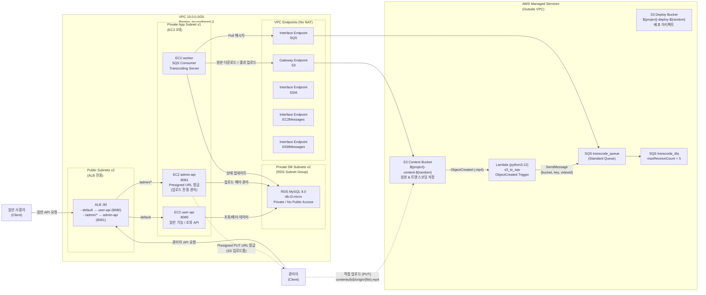

# 🎬 O+T (Open the Taste) - Backend System

## 📌 1. Project Overview
**O+T(오쁠티)** 는 단순 알고리즘 추천의 한계를 보완하고 사용자의 콘텐츠 탐색 피로도를 낮추기 위해 기획된 숏폼/롱폼 연계 OTT 플랫폼입니다.
본 레포지토리는 서비스의 백엔드 API 서버 및 비동기 영상 트랜스코딩 시스템을 포함하고 있습니다.

핵심 비즈니스 로직은 **에디터/관리자 기반의 숏폼 업로드**와 **숏폼에서 본편(롱폼)으로의 즉각적인 전환(CTA)** 을 지원하는데 맞춰줘 있습니다.
기술적으로는 대용량 영상 처리로 읺ㄴ API 서버 부하를 방지하고 HLS 기반의 적응형 스트리밍(ABR) 을 안정적으로 제공하는 인프라 및 소프트웨어 아키텍처 설계에 집중했습니다.


## 2. 시스템 및 인프라 아키텍처
### 🏗️ 전체 인프라 아키텍처 (System Architecture)



위 다이어그램은 O+T 서비스의 핵심 인프라 구성도로, 네트워크 보안 강화, 비용 최적화, 미디어 처리의 비동기화에 초점을 맞추어 설계되었습니다.

#### 1. 네트워크 격리 및 보안(VPC & Subnate)
- 외부의 모든 클라이언트 트래픽은 Public Subnet에 위치한 ALB(Application Load Balancer) 1곳을 통해서만 인입됩니다.

- 실제 비즈니스 로직이 실행되는 3대의 EC2(User API, Admin API, Transcoder Worker)와 데이터가 저장되는 RDS MySQL은 모두 Private Subnet에 완벽히 격리하여 외부 인터넷으로부터의 직접적인 접근을 원천 차단했습니다.

#### 2. 도메인별 트래픽 라우팅 분리
- ALB의 경로 기반 라우팅(Path-based Routing) 규칙을 적용하여 물리적인 서버 인스턴스를 분리했습니다.

- 에디터 전용 업로드 및 관리자 요청(/admin/*)은 Admin API 인스턴스(8081 포트)로, 검색/피드 조회/스트리밍 등 트래픽이 집중되는 일반 대고객 요청은 User API 인스턴스(8080 포트)로 전달하여 도메인 간 간섭을 최소화했습니다.

#### 3. No-NAT 기반 프라이빗 통신(VPC Endpoints)
- Private Subnet 내부의 서버가 외부 AWS Managed Service(S3, SQS 등)와 통신하기 위해 필수적인 NAT Gateway를 과감히 제거했습니다. (월 고정 비용 절감)

- 대신 AWS 내부망 전용선인 VPC Endpoints를 구축했습니다. 대용량 영상의 다운로드/업로드는 무료인 S3 Gateway Endpoint를 거치며, 작업 대기열 확인은 SQS Interface Endpoint를 통해 퍼블릭 인터넷망 노출 없이 안전하고 빠르게 처리됩니다.

#### 4. 서버리스 이벤트 브릿지(Event-Driven Pipeline)
- Admin API가 S3 Presigned URL을 발급하면, 클라이언트는 서버를 거치지 않고 S3 버킷으로 원본 영상을 직행시킵니다.

- 영상이 S3에 도착하면 발생하는 ObjectCreated 이벤트를 AWS Lambda가 즉시 낚아채어, 메타데이터와 함께 **SQS(Standard Queue)**로 트랜스코딩 작업 메시지를 밀어 넣습니다.


#### 5. 보안 접속 및 CI/CD 배포 자동화(AWS SSM)
- 보안 위협이 될 수 있는 외부 SSH 포트(22) 개방이나 별도의 Bastion Host(점프 서버) 구축을 배제했습니다.

- SSM Interface Endpoint를 통해 AWS Systems Manager(Session Manager, Run Command)로 Private EC2에 안전하게 접속하며, GitHub Actions와 연동하여 무중단 자동 배포 파이프라인을 구동합니다.


### 📁 소프트웨어 아키텍처 (Multi-Module Monorepo)
영상 트랜스코딩(FFmpeg)은 CPU 자원을 극도로 소모하는 작업입니다. 단일 모놀리식 구조에서 API 요청 처리와 인코딩 작업을 병행할 경우, 인코딩 부하가 일반 사용자 API의 응답 지연 및 장애로 전파될 위험이 있습니다.
이를 방지하고 개발 효율성을 높이기 위해 멀티 모듈 모노레포 및 레이어드 아키텍처를 채택했습니다.

- **배포 단위 분리 (apps/):**
  - api-user: 일반 사용자의 콘텐츠 검색, 재생, 통계 조회를 전담하는 API 서버.

  - api-admin: 관리자 및 에디터의 메타데이터 관리, 영상 업로드(Presigned URL 발급)를 전담하는 백오피스 서버.

  - transcoder: 외부 요청을 직접 받지 않고, SQS 메시지를 폴링하여 비동기로 영상을 변환하는 워커(Worker) 서버.
 
- **공통 모듈 분리 (modules/):**
  - 각 서버에서 공통으로 사용하는 도메인(Entity, Repository), 인프라 연동(S3, SQS 설정), 웹 공통(예외 처리, 응답 DTO), 보안(JWT, OAuth) 로직을 분리하여 코드 중복을 제거했습니다.

```
repo-root/
├── apps/                    ← 실제 배포 단위 (각각 독립 JAR)
│   ├── api-admin/           ← 관리자/에디터 API 서버
│   ├── api-user/            ← 사용자 API 서버  
│   └── transcoder/          ← 트랜스코딩 워커
│
├── modules/                 ← 공유 모듈 (단독 실행 불가, 앱에서 의존)
│   ├── domain/              ← 전체 Entity + Repository (JPA)
│   ├── infra/               ← JPA 설정 + S3 설정
│   ├── common-web/          ← 예외처리, 응답 포맷
│   └── common-security/     ← JWT, OAuth
│
├── settings.gradle
└── docker-compose.yml


----------------------------------------


repo-root/
├── apps/
│   ├── api-admin/                      # 백오피스 서버 (JAR)
│   │   └── src/main/java/com/ott/admin/
│   │       ├── content/
│   │       │   ├── controller/
│   │       │   ├── service/
│   │       │   └── dto/
│   ├── api-user/                       # 사용자 API 서버 (JAR)
│   │   └── src/main/java/com/ott/user/
│   │       ├── auth/
│   │       │   ├── controller/
│   │       │   ├── service/
│   │       │   └── dto/
│   │       ├── content/
│   │       │   ├── controller/
│   │       │   ├── service/
│   │       │   └── dto/
│   │       └── config/
│   │
│   └── transcoder/                     # 트랜스코딩 워커 (JAR)
│       └── src/main/java/com/ott/transcode/
│           ├── worker/
│           ├── service/
│           └── config/
│
├── modules/
│   ├── domain/                         # 전체 도메인 (Entity + Repository)
│   │   └── src/main/java/com/ott/domain/
│   │       ├── content/
│   │       │   ├── entity/
│   │       │   └── repository/
│   │       └── series/
│   │           ├── entity/
│   │           └── repository/
│   │
│   ├── infra/                          # DB + S3 설정
│   │   └── src/main/java/com/ott/infra/
│   │       ├── db/
│   │       │   ├── config/
│   │       │   └── BaseEntity.java
│   │       └── s3/
│   │           ├── config/
│   │           └── S3FileService.java
│   │
│   ├── common-web/                     # 웹 공통
│   │   └── src/main/java/com/ott/common/web/
│   │       ├── exception/
│   │       └── response/
│   │
│   └── common-security/                # 인증/인가 공통
│       └── src/main/java/com/ott/common/security/
│           ├── jwt/
│           └── oauth/
│
├── docker-compose.yml
├── settings.gradle
└── build.gradle
```


## 3. 핵심 기술 및 비즈니스 로직
### 3.1 이벤트 기반 미디어 처리 파이프라인


### 3-2 스트리밍(영상 재생) 파이프라인
