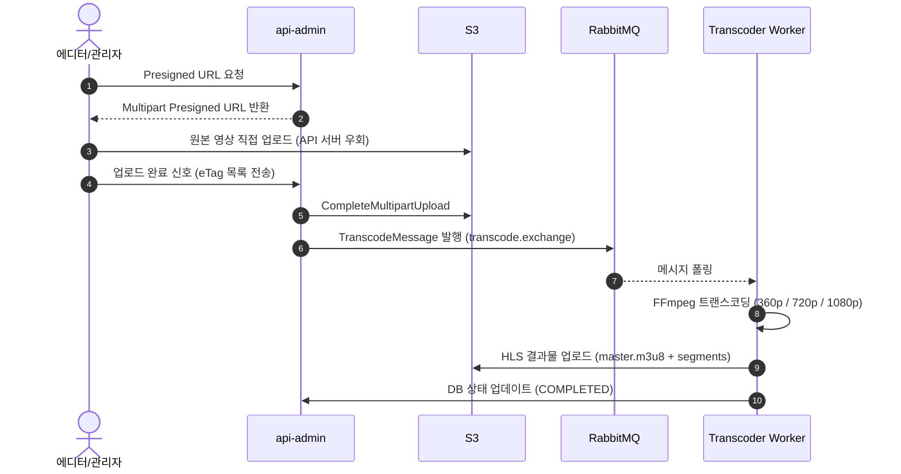
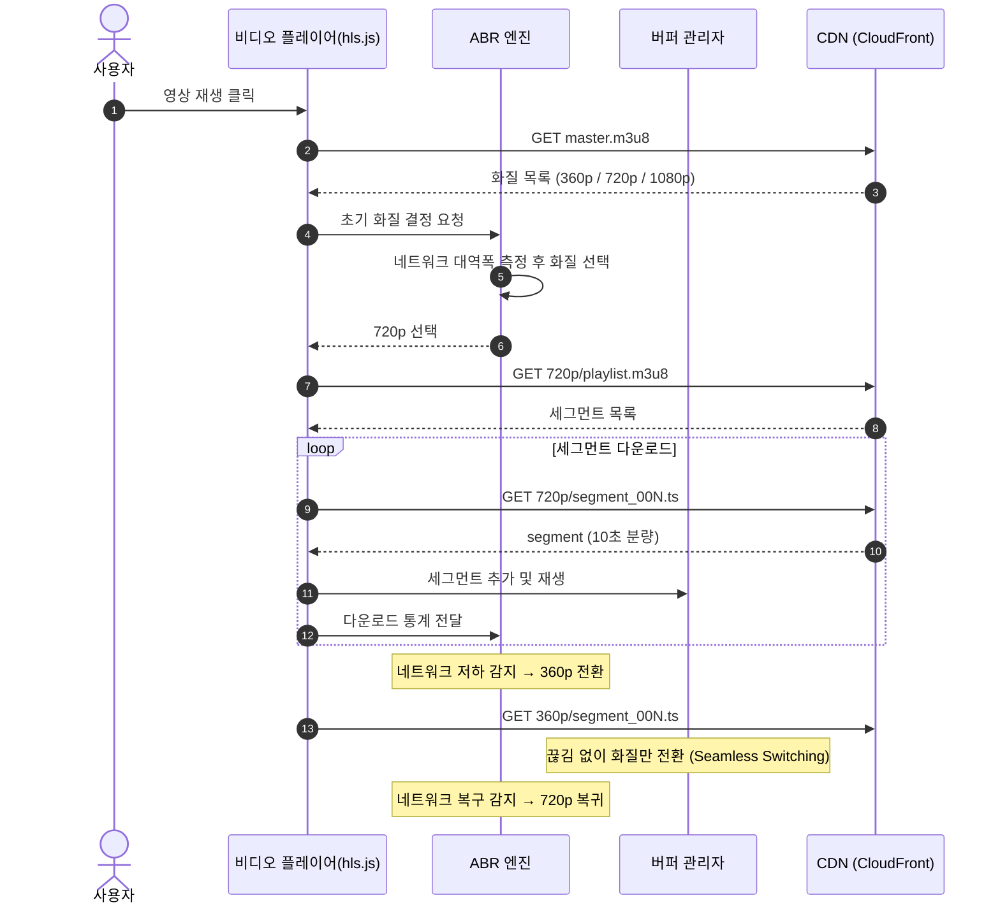

# O+T (Open The Taste) — Backend Platform

> OTT 스트리밍 플랫폼 백엔드


---

## 📌 1. Project Overview

**O+T(오쁠티)** 는 단순 알고리즘 추천의 한계를 보완하고 사용자의 콘텐츠 탐색 피로도를 낮추기 위해 기획된 숏폼/롱폼 연계 OTT 플랫폼입니다.  
본 레포지토리는 서비스의 백엔드 API 서버 및 비동기 영상 트랜스코딩 시스템을 포함하고 있습니다.

핵심 비즈니스 로직은 **에디터/관리자 기반의 숏폼 업로드**와 **숏폼에서 본편(롱폼)으로의 즉각적인 전환(CTA)** 을 지원하는 데 맞춰져 있습니다.  
기술적으로는 대용량 영상 처리로 인한 API 서버 부하를 방지하고 HLS 기반의 적응형 스트리밍(ABR)을 안정적으로 제공하는 인프라 및 소프트웨어 아키텍처 설계에 집중했습니다.

- **개발 기간:** 2026.02.04 ~ 2026.03.20

---

## 🛠️ 2. 기술 스택

| 분류 | 기술 |
|------|------|
| Backend | Java 21, Spring Boot 3.x, Spring Data JPA, QueryDSL, FastAPI (Python) |
| Database | MySQL 8.0 (RDS), Flyway |
| Media | FFmpeg, HLS (Adaptive Bitrate Streaming) |
| Message Queue | RabbitMQ |
| Infra | AWS (EC2, S3, ALB, CloudFront, Route53), Docker |
| Security | Spring Security, JWT (jjwt), Kakao OAuth2 |
| AI/ML | HuggingFace Transformers, Gemini API |
| Observability | Prometheus, Grafana, Loki |
| CI/CD | GitHub Actions |

---

## 🏗️ 3. 시스템 및 인프라 아키텍처

### 3.1 전체 인프라 아키텍처


**설계 핵심 포인트**

- **네트워크 격리:** 모든 EC2와 RDS를 Private Subnet에 배치, ALB 하나로만 외부 트래픽 인입
- **도메인별 라우팅 분리:** 일반 사용자 트래픽(8080)과 관리자/에디터 트래픽(8081)을 물리적으로 분리
- **No-NAT 설계:** NAT Gateway 제거 후 VPC Endpoint로 S3 접근 — 보안 강화 및 비용 절감
- **이벤트 드리븐 파이프라인:** Multipart 완료 → RabbitMQ `transcode.exchange` → Transcoder Worker 완전 비동기화
- **SSH-Free 배포:** SSM Session Manager + GitHub Actions로 Bastion Host 없이 Private EC2 접속

---

### 3.2 소프트웨어 아키텍처 (Multi-Module Monorepo)

FFmpeg 트랜스코딩은 CPU를 극도로 소모하는 작업입니다. 단일 모놀리식 구조에서는 인코딩 부하가 API 응답 지연으로 전파될 위험이 있어, **멀티 모듈 모노레포 + 레이어드 아키텍처**를 채택했습니다.

```
repo-root/
├── apps/                       ← 실제 배포 단위 (각각 독립 JAR)
│   ├── api-user/               ← 사용자 API 서버 (포트 8080)
│   ├── api-admin/              ← 관리자/에디터 API 서버 (포트 8081)
│   ├── transcoder/             ← 트랜스코딩 워커 (포트 8082)
│   ├── machine/                ← FastAPI AI 서버 (포트 8000)
│   └── monitoring/             ← Prometheus + Grafana 설정
│
├── modules/                    ← 공유 모듈 (단독 실행 불가, 앱에서 의존)
│   ├── domain/                 ← 전체 Entity + Repository (JPA + QueryDSL)
│   ├── infra-db/               ← DB 설정 + Flyway 마이그레이션 (V1~V10)
│   ├── infra-s3/               ← S3 Presign / Multipart Upload
│   ├── infra-mq/               ← RabbitMQ 메시지 발행 (TranscodeMessage)
│   ├── common-web/             ← 예외처리, 응답 포맷, Swagger
│   └── common-security/        ← JWT, OAuth2
│
├── docker-compose.yml
└── settings.gradle
```

| 배포 단위 | 역할 |
|-----------|------|
| `api-user` | 유저 API — 플레이리스트, 댓글, 북마크, 시청이력, AI 연동 |
| `api-admin` | 백오피스 API — 콘텐츠 업로드, AI 태깅, 인제스트 관리, 통계 |
| `transcoder` | RabbitMQ 컨슈머 → FFmpeg HLS 변환 → S3 업로드 |
| `machine` | FastAPI ML 서버 — HuggingFace 태깅 모델, MLP 기분 추천 모델 |

---

## 🎬 4. 핵심 기술 및 비즈니스 로직

### 4.1 업로드 및 트랜스코딩 프로세스 (Event-Driven Ingest)

대용량 영상 파일 업로드 시 API 서버의 I/O 병목을 방지하기 위해  
**S3 다이렉트 업로드 + RabbitMQ 기반 비동기 트랜스코딩** 방식을 적용했습니다.


**IngestJob 상태 흐름**

| 단계 | IngestJob | IngestCommand |
|------|-----------|---------------|
| 메시지 수신 직후 | `PENDING` | `PENDING` |
| 트랜스코딩 중 | `PROCESSING` | `PENDING` |
| 일부 해상도 완료 | `PARTIAL_SUCCESS` | `COMPLETED` (일부) |
| 전체 완료 | `SUCCESS` | `COMPLETED` |
| 실패 | `FAILED` | — |

> `IngestCommand`는 `TRANSCODE` / `THUMBNAIL` 작업을 각각 독립적으로 추적합니다.
**패키징 결과물 (S3 디렉토리 구조)**

```
transcoded/{videoId}/
├── master.m3u8
├── 360p/
│   ├── playlist.m3u8
│   ├── segment_000.ts  (~1MB)
│   └── ...
├── 720p/
│   ├── playlist.m3u8
│   ├── segment_000.ts  (~3MB)
│   └── ...
└── 1080p/
    ├── playlist.m3u8
    ├── segment_000.ts  (~6MB)
    └── ...
```

---

### 4.2 스트리밍 파이프라인 (HLS & ABR)

사용자의 디바이스 및 실시간 네트워크 환경에 맞춰 최적의 화질을 끊김 없이 제공하는 ABR(Adaptive Bitrate) 재생 프로세스입니다.



---

### 4.3 인증/인가 시스템

- **유저:** Kakao OAuth2 → JWT (Access 30분 / Refresh 14일) → HttpOnly 쿠키
- **관리자:** Local email/bcrypt → 동일 JWT 전략, `ADMIN` / `EDITOR` 롤만 허용
- **미디어 CDN:** CloudFront Signed Cookie (RSA 서명, TTL 설정)
- **Token Rotation:** Refresh 재발급 시 기존 토큰 폐기 → 새 토큰 DB 저장

---

### 4.4 AI 기능

**AI 감정 태깅**
- 콘텐츠 업로드 후 `@Async + @TransactionalEventListener(AFTER_COMMIT)`으로 메인 트랜잭션과 격리 후 비동기 실행
- 줄거리 → FastAPI `/tagging` → HuggingFace 모델 → 상위 3개 mood_tag → DB 저장 (priority 포함)

**분위기 환기 (Mood Refresh)**
- 시청 이력 이벤트 발생 시 6h 쿨다운 확인 → 72h 내 최근 3개 시청 기록 감정 패턴 분석
- FastAPI `/recommend` → Gemini API 개인화 문구 생성 → 홈 화면 환기 카드 노출

---

### 4.5 플레이리스트 전략 패턴

6가지 진입 시점(ContentSource)별로 다른 QueryDSL 로직을 `PlaylistStrategy` 인터페이스로 분리하여 확장성을 확보했습니다.

| ContentSource | 전략 | 정렬 기준 |
|---------------|------|-----------|
| `TRENDING` | TrendingPlaylistStrategy | 북마크 수 내림차순 |
| `RECOMMEND` | RecommendPlaylistStrategy | TagScore 가중합 (선호+5 / 시청+3 / 좋아요+2) |
| `HISTORY` | HistoryPlaylistStrategy | 최근 시청일 내림차순, 시리즈 중복 병합 |
| `TAG` | TagPlaylistStrategy | 홈=50개 shuffle / 상세=페이징 |
| `BOOKMARK` | BookmarkPlaylistStrategy | 북마크 등록일 내림차순 |
| `SEARCH` | → RECOMMEND 우회 | excludeMediaId 존재 시 자동 전환 |

---

### 4.6 숏폼 피드 알고리즘

```
1. TagScore 계산   선호 +5 / 시청이력 +3 / 좋아요 +2 합산
2. 추천 70%        QueryDSL CaseBuilder 가중치 SUM → 취향 기반 숏폼
3. 최신 30%        추천 ID 제외 후 createdDate.desc() 최신 숏폼
4. 합산 & 셔플     Collections.shuffle() 랜덤화 후 노출
5. 클릭 통계       SHORT_CLICK / CTA_CLICK 집계 → 전환율(%) = CTA / SHORT × 100
```

---

## 🚀 5. 로컬 실행

### Prerequisites

- Java 21, Docker & Docker Compose
- FFmpeg (로컬 트랜스코딩 테스트용)
- AWS 자격정보 (S3 실제 업로드 테스트 시)

### 환경 변수 설정

| 카테고리 | 주요 환경 변수 |
|---------|--------------|
| DB | `MYSQL_*`, `SPRING_DATASOURCE_*` |
| 인증 | `KAKAO_*`, `JWT_SECRET_BASE64` |
| S3 / CDN | `AWS_*`, `CF_SIGNED_COOKIE_*` |
| 메시징 | `RABBITMQ_HOST`, `RABBITMQ_PORT`, `RABBITMQ_USERNAME`, `RABBITMQ_PASSWORD` |
| FFmpeg | `FFMPEG_PATH`, `FFPROBE_PATH`, `TRANSCODER_TEMP_DIR` |
| AI | `AI_BASE_URL`, `AI_TAGGING_MODEL_PATH`, `GEMINI_API_KEY` |

### 실행

```bash
# 전체 서비스 시작 (MySQL, RabbitMQ, api-user, api-admin, transcoder, machine)
docker compose up --build

# 개별 모듈 빌드
./gradlew :apps:api-user:bootJar
./gradlew :apps:api-admin:bootJar

# 모니터링 스택 (Prometheus + Grafana)
docker compose -f apps/monitoring/docker-compose.yml up -d
```

### Health Check

```bash
curl http://localhost:8080/actuator/health  # api-user
curl http://localhost:8081/actuator/health  # api-admin
curl http://localhost:8000/health           # machine (AI)
# RabbitMQ Management UI: http://localhost:15672
```

---

## 📡 6. 주요 API 엔드포인트

### api-user (:8080) · Swagger: `/swagger-ui/index.html`

| Method | Endpoint | 설명 |
|--------|----------|------|
| GET | `/playlists/{trending\|recommend\|history\|bookmarks\|search}` | 진입점별 플레이리스트 |
| GET | `/playlists/tags/top` | Top 3 태그별 플레이리스트 |
| GET | `/short-forms` | 숏폼 피드 (추천 70% + 최신 30%) |
| PUT | `/playback` | 이어보기 위치 UPSERT |
| PUT | `/watch-history` | 시청 이력 UPSERT + Mood Refresh 트리거 |
| GET | `/mood-refresh/active` | 활성 분위기 환기 카드 조회 |
| POST | `/bookmarks` | 북마크 토글 |
| GET | `/radar/recommend` | 레이더 차트 가중합 추천 |

### api-admin (:8081) · Swagger: `/back-office/swagger-ui/index.html`

| Method | Endpoint | 설명 |
|--------|----------|------|
| POST | `/back-office/admin/contents/upload` | 콘텐츠 메타데이터 생성 |
| POST | `/back-office/admin/contents/{id}/upload/complete` | Multipart 완료 + 트랜스코딩 트리거 |
| GET | `/back-office/admin/short-form-conversion` | 숏폼 전환율 통계 |
| GET | `/back-office/admin/tags/stats/{categoryId}` | 태그별 시청 통계 |
| GET | `/back-office/ingest-jobs` | 업로드 작업 목록 |

---

## 📊 7. 모니터링

| 서비스 | 주소 |
|--------|------|
| Prometheus | `http://localhost:9090` |
| Grafana | `http://localhost:3001` |
| RabbitMQ Management | `http://localhost:15672` |
| Actuator Health | `/actuator/health` |
| Actuator Metrics | `/actuator/prometheus` |

---
## 👥 8. Contributing

|  |  |  |  |
|:---:|:---:|:---:|:---:|
| **강승우** | **박준희** | **박유빈** | **이창기** |
| [@phonil](https://github.com/phonil) | [@marulog](https://github.com/marulog) | [@yubin012](https://github.com/yubin012) | [@arlen02-01](https://github.com/arlen02-01) |
| Backend | Backend | Backend | Backend |

- **브랜치 전략:** `main` / `develop` / `feature/{이슈번호}-{기능명}`
- **커밋 컨벤션:** `feat:` / `fix:` / `refactor:` / `docs:` / `chore:` prefix 사용
- **PR 규칙:** 최소 1인 이상 승인 후 머지, PR 템플릿 준수
- **Jira 연동:** 브랜치명과 커밋에 이슈 번호 포함 (`feature/OT-123-기능명`)
- 자세한 코드 리뷰 가이드는 `coderabbit/coderabbit-guidelines.md` 참고

---

## 🗺️ 9. Next Step

- **모니터링 강화:** 트랜스코딩 워커 CPU 임계치 및 ABR 대역폭 전환 통계 시각화
- **Redis 도입:** 이어보기 위치 Write-Behind 캐싱, 실시간 인기 차트 캐시
- **Kafka 도입:** RabbitMQ → Pub/Sub 기반 이벤트 스트리밍으로 트랜스코딩·분석·썸네일 워커 병렬 소비
- **S3 Cross-Region DR:** 영상 데이터 교차 리전 복제 백업 아키텍처

---

> 📎 아키텍처 상세 설계, 기술 도입 배경, 트러블슈팅 등 자세한 내용은 [Wiki](https://github.com/OpenTheTaste/backend/wiki)를 참고해주세요.

 ### 📚 Wiki 목차 보기
#### 1. 🎥 영상 처리
* [🎥 트랜스코딩 구조](🎥-트랜스코딩-구조)
* [🎥 트랜스코딩 프로세스](🎥-트랜스코딩-프로세스)
* [🎥 트랜스코딩 상태 관리](🎥-트랜스코딩-상태-관리)
* [🎥 트랜스코딩 예외 처리](🎥-트랜스코딩-예외-처리)
* [🎥 영상 업로드](🎥-영상-업로드)

#### 2. 💾 데이터베이스
* [💾 데이터베이스 모델](💾-데이터베이스-모델)

#### 3. ☁️ 인프라 및 아키텍처
* [☁️ 인프라 구조](☁️-인프라-구조)
* [☁️ CDN 구성](☁️-CDN-구성)
* [☁️ 트랜스코딩 서버 구성](☁️-트랜스코딩-서버-구성)
* [☁️ S3 관리 전략](☁️-S3-관리-전략)
* [📂 멀티모듈 & 소프트웨어 아키텍처](📂-멀티모듈-&-소프트웨어-아키텍처)

#### 4. 💡 기술 도입 및 상세
* [🐇 RabbitMQ 사용 이유](🐇-RabbitMQ-사용-이유)
* [🔥 소셜 로그인 & JWT 도입 이유](🔥-소셜-로그인-&-JWT-도입-이유)
* [🚨 아웃박스 스케줄러 다중 서버 중복 실행 방지](🚨-아웃박스-스케줄러-다중-서버-중복...)
* [🪄 사용자 커스텀 추천 (feat. 레이더 차트)](🪄-사용자-커스텀-추천-(feat.-레이더-차...))
* [🎯 플레이리스트 전략 패턴](🎯-플레이리스트-전략-패턴)
* [📱 숏폼 피드 알고리즘](📱-숏폼-피드-알고리즘)
* [🤖 AI 태깅 & 분위기 환기 시스템](🤖-AI-태깅-&-분위기-환기-시스템)

#### 5. 🧪 성능 테스트
* [🧪 k6 부하 테스트 — 플레이리스트 API](🧪-k6-부하-테스트)


*Last updated: 2026.03*
